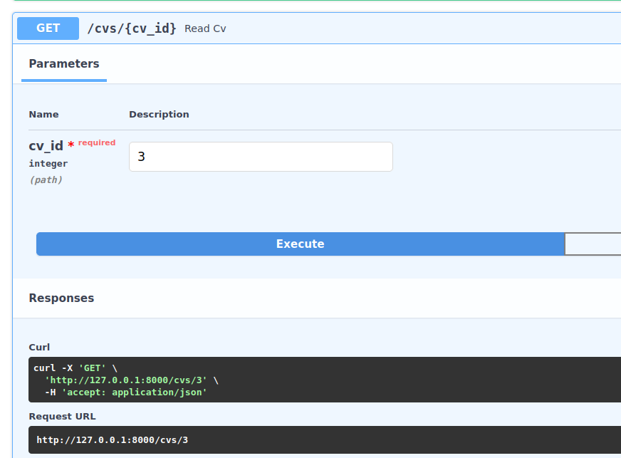

# READ ME PLEASE ;)

### REST API

Simple rest api example (without authentication, authorization,

tests, etc, etc.) was created to show basic skills. Maybe in the

future I will develope this project (who knows!) :)

### Dependencies

pip install -r requirements.txt

### Rurn program:

On your system run:

```Bash
uvicorn app:app --reload
```

On local web browser app is available on the:

```Python
http://127.0.0.1:8000
```

### Curriculum vitate

Hmmmm, api should do something - this one is using CRUD to show

my CV - cv can be created, updated, get and deleted (in form of

JSON input/output).

Please checkout the code..

Create payload example:

```Json

{
  "name": "Przemysław Tutur",
  "email": "przemektutur@poczta.fm",
  "experience": [
    {
      "company": "Dell Technologies",
      "position": "Consultant",
      "from_date": "2022-02-01",
      "description": "Automation, migration, DevOps and Python development. Architecture"
    },
    {
      "company": "Accenture Sp. z o.o.",
      "position": "Tech Arch Delivery Team Lead",
      "from_date": "2017-11-01",
      "to_date": "2022-02-01",
      "description": "DDI, Networking, Teamleading, Python automation and tests"
    },
    {
      "company": "Cubiware Sp. z o.o.",
      "position": "Support Engineer",
      "from_date": "2013-08-01",
      "to_date": "2017-10-01",
      "description": "Linux and database administration (MySQL/PostgreSQL), Presales"
    }
  ],
  "education": [
    {
      "institution": "Polish-Japanese Academy of Information Technology",
      "degree": "Big Data - Collections of Large Data",
      "from_date": "2023-01-01",
      "to_date": "2024-01-01"
    },
    {
      "institution": "West Pomeranian University of Technology",
      "degree": "Telecommunications and Electronics",
      "from_date": "2009-01-01",
      "to_date": "2013-01-01"
    },
    {
      "institution": "Szczecin Technical University",
      "degree": "Chemical Organic Technology",
      "from_date": "2002-01-01",
      "to_date": "2007-01-01"
    }
  ],
  "skills": [
    {
      "name": "Programming",
      "level": "Python, Bash, PowerShell, C#"
    },
    {
      "name": "OS",
      "level": "Linux, Windows"
    },
    {
      "name": "Networking",
      "level": "Routing, Switching, Automation, Loadbalancing"
    },
    {
      "name": "Database",
      "level": "MySQL/SQL"
    },
    {
      "name": "Cloud",
      "level": "AZ-104, AZ-303 (Azure Certificates 2021/22)"
    },
    {
      "name": "Additional",
      "level": "Machine Learning, Git, Ansible, Docker, Kubernetes"
    },
    {
      "name": "Languages",
      "level": "English (Advanced), Chinese (Basic), Polish (Native), Russian (Basic)"
    }
  ]
}

```

### Pictures

Picasso pictures of working app ;)

Create request:


Create response:


Get request



Get response:


Update request


Update response:


Delete request


Delete response:


